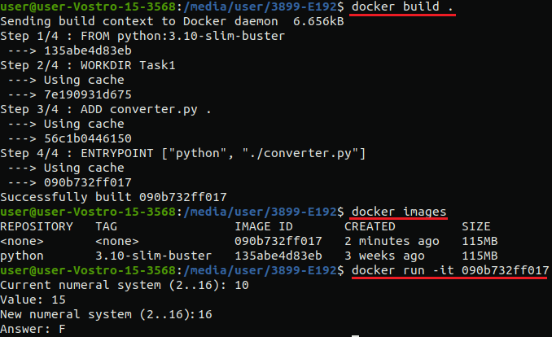

# Основы программной инженерии  
## Конвертер из одной системы счисления в другую  

Разработан python скрипт для перевода различных чисел из одной системы счисления в другую. Поддерживаются системы счисления до 16 включительно.

Пример работы:  
```
>>>python converter.py
Current numeral system (2..16): 10
Value: 15
New numeral system (2..16): 16
Answer: F
```

Запуск скрипта в docker контейнере:  
```docker build .```  
```docker run -it <image> ```  

